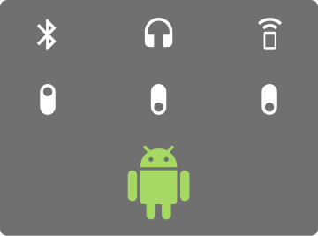

# AudioSwitch

[](https://circleci.com/gh/twilio/audioswitch)

An Android audio management library for real-time communication apps.



## Features

- [x] Manage [audio focus](https://developer.android.com/guide/topics/media-apps/audio-focus) for typical VoIP and Video conferencing use cases.
- [x] Manage audio input and output devices.
    - [x] Detect changes in available audio devices
    - [x] Enumerate audio devices
    - [x] Select an audio device

## Requirements

Android Studio Version | Android API Version Min
------------ | -------------
3.6+ | 16

## Getting Started

To get started using this library, follow the steps below.

### Gradle Setup

[ ](https://bintray.com/twilio/releases/audioswitch/_latestVersion)

Add this line as a new Gradle dependency:
```groovy
implementation 'com.twilio:audioswitch:$version'
```

Pull requests merged to master result in an artifact being published to [JFrog OSS Snapshots](https://oss.jfrog.org/artifactory/webapp/#/home). You can
access these snapshots by adding the following to your gradle file.

```groovy
maven {
    url 'https://oss.jfrog.org/artifactory/libs-snapshot/'
}

implementation 'com.twilio:audioswitch:$version-SNAPSHOT'
```

### AudioDeviceSelector Setup
Instantiate an instance of the [AudioDeviceSelector](audioswitch/src/main/java/com/twilio/audioswitch/selection/AudioDeviceSelector.kt) class, passing a reference to the application context.

```kotlin
val audioDeviceSelector = AudioDeviceSelector(applicationContext)
```

### Listen for Devices
To begin listening for live audio device changes, call the start function and pass a lambda that will receive [AudioDevices](audioswitch/src/main/java/com/twilio/audioswitch/selection/AudioDevice.kt) when they become available.

```kotlin
audioDeviceSelector.start { audioDevices, selectedDevice ->
    // TODO update UI with audio devices
}
```
You can also retrieve the available and selected audio devices manually at any time by calling the following properties:
```kotlin
val devices: List<AudioDevice> = audioDeviceSelector.availableAudioDevices
val selectedDevice: AudioDevice? = audioDeviceSelector.selectedAudioDevice
```
**Note:** Don't forget to stop listening for audio devices when no longer needed in order to prevent a memory leak.
```kotlin
audioDeviceSelector.stop()
```

### Select a Device
Before activating an AudioDevice, it needs to be selected first.
```kotlin
devices.find { it is AudioDevice.Speakerphone }?.let { audioDeviceSelector.selectDevice(it) }
```
If no device is selected, then the library will automatically select a device based on the following priority: `BluetoothHeadset -> WiredHeadset -> Earpiece -> Speakerphone`.

### Activate a Device
Activating a device acquires audio focus with [voice communication usage](https://developer.android.com/reference/android/media/AudioAttributes#USAGE_VOICE_COMMUNICATION) and begins routing audio input/output to the selected device.
```kotlin
audioDeviceSelector.activate()
```
Make sure to revert back to the prior audio state when it makes sense to do so in your app.
```kotlin
audioDeviceSelector.deactivate()
```
**Note:** The `stop()` function will call `deactivate()` before closing AudioDeviceSelector resources.

## Bluetooth Support

Multiple connected bluetooth headsets are supported.
  - The library will accurately display the up to date active bluetooth headset within the `AudiodDeviceSelector` `availableAudioDevices` and `selectedAudioDevice` functions.
    - Other connected headsets are not stored by the library at this moment.
  - In the event of a failure to connecting audio to a bluetooth headset, the library will revert the selected audio device (this is usually the Earpiece on a phone).
  - If a user would like to switch between multiple Bluetooth headsets, then they need to switch the active bluetooth headset from the system Bluetooth settings.
    - The newly activated headset will be propagated to the `AudiodDeviceSelector` `availableAudioDevices` and `selectedAudioDevice` functions.

## Java Compatibility

Audioswitch is compatible with apps written in Java that [target Java 8](https://developer.android.com/studio/write/java8-support), and follows the recommendations provided in the [Kotlin for Java consumption guide](https://developer.android.com/kotlin/interop#kotlin_for_java_consumption). The project includes [Java specific unit tests](https://github.com/twilio/audioswitch/tree/master/audioswitch/src/test/java/com/twilio/audioswitch) that demonstrate how to use Audioswitch from a Java based application. If you have any Java compatibility questions please [open an issue](https://github.com/twilio/audioswitch/issues).

## Logging

By default, AudioSwitch logging is disabled. Reference the following snippet to enable AudioSwitch logging:

  ```kotlin
 val audioDeviceSelector = AudioDeviceSelector(context)

 audioDeviceSelector.loggingEnabled = true

 audioDeviceSelector.start { _, _ -> }
 ```


## Usage Examples

* [Twilio Video Android App](https://github.com/twilio/twilio-video-app-android)
* [Twilio Video Android Quickstart](https://github.com/twilio/video-quickstart-android)
* [Twilio Voice Android Quickstart](https://github.com/twilio/voice-quickstart-android)

## License

Apache 2.0 license. See [LICENSE.txt](LICENSE.txt) for details.
